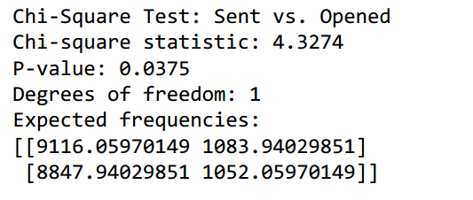

# Project Overview: A/B Testing Email Campaign for Football Forecasting Subscription

## Objective
The goal of this project is to analyze the effectiveness of two different email campaigns promoting a football results forecasting subscription. Using A/B testing, we aim to determine which email drives higher engagement and conversions, helping us optimize future marketing efforts. 

## Dataset & Storage
The dataset is stored in an SQLite database (Email_campaign.db) in a table named email_ab_test_data. It contains the following key metrics:
Sent: Number of emails sent   
Bounced: Number of undelivered emails  
Opened: Number of recipients who opened the email  
Sales: Number of users who subscribed after opening the email  

A/B Test Setup
We designed two email variations (A & B) targeting sports fans and bettors:

Email A – “Win More Bets with Expert Football Predictions!”  
Subject: Get Ahead of the Game!   
Hey Mr Procter,  
Want to win more bets and stay ahead of the competition? Our football forecasting subscription gives you expert insights, real-time predictions, and the edge you need to cash in on every match!  
What You Get:  
•	Accurate match predictions  
•	Betting tips from pros  
•	Exclusive insights on teams & stats 
 
 
Don’t guess. Predict smarter. Win bigger.  
Join now and get your first week FREE!  
[Subscribe Now]  
Let’s make every match a winning one!   
Cheers,  
Adam Smith    
‘Rage Against The Machine’  

Email B – “Your Winning Streak Starts Here! ”  
Subject: The Smartest Bettors Use This…   
Hey Stu Ungar,  
What if you never placed a bad bet again? Our football forecasting service helps you make data-driven bets that actually pay off!  
Why Join?  
 AI-powered predictions for every game  
 Higher accuracy, bigger profits  
 Insider tips from betting experts  
No more guesswork. Only smart bets.  
💥 Sign up now & get your first week FREE! 💥  
[Start Winning Now]  
See you on the winning side!   
Cheers,  
[Adam Smith]  
‘Rage Against The Machine’  

Key A/B Testing Differences:  
•	Email A: Focuses on expert insights and informed predictions for smart betting.  
•	Email B: Highlights AI-powered accuracy and the financial benefits of subscribing.  
•	Subject Lines: One is about winning more bets, while the other hints at an exclusive edge.    
Both emails were sent to different random groups of recipients.

